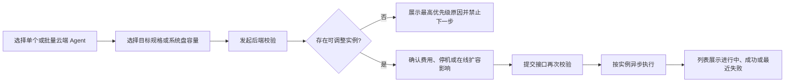

# 01. Clarify — 需求澄清

> 来源：TAPD Story [135662225](https://tapd.woa.com/tapd_fe/20422209/story/detail/1020422209135662225)（长 ID：`1020422209135662225`）
>
> 读取范围：需求正文、33 张正文图片、评论；当前需求状态「待启动」，优先级 High，最后更新时间 `2026-07-17 09:49:39`。
>
> **步骤状态：已完成。** Q1-Q9、项目代码现状及腾讯云 CVM/CBS API 约束均已核验；独立复核未发现剩余 blocker，真实账号差异已转为 IT 验证项。

---

## 基本信息

| 项 | 内容 |
|----|------|
| 标题 | 【clawpro】存量 Agent 实例规格升配与系统盘容量扩容 - M1 |
| 产品经理 | pixzheng |
| 后端开发 | yutaoguo |
| 前端开发 | barryfli |
| 明确 DDL | 2026-07-31 |
| 适用客户 | 所有 ClawPro 用户；触发客户为博商、费芮 |
| 页面入口 | 运维与观测 → Agent 列表 |

## 背景与问题

M0 只解决新建 Agent 时按企业或分组策略配置计费模式、CPU、内存、磁盘和公网资源，不能调整已创建实例的真实云资源。

博商现有 1000+ 台实例，规格偏低会造成 Agent 和云桌面卡顿；当前只能进入腾讯云控制台逐台查询、升配，操作成本和误操作风险较高。历史客户还提出系统盘创建后扩容诉求。

本需求与现有分组能力边界明确：分组能力处理实例归属、可见性和后续策略匹配；M1 直接改变存量 CVM 的 CPU/内存规格或系统盘容量，分组变化本身不会触发底层资源变更。

## 目标与可验收结果

1. 管理员可从 Agent 列表对单台或多台云端 Agent 发起配置调整；本地 Agent 不提供入口。
2. 实例规格只允许在以下 AI2 规格序列内升配：
   - `Ai2.MEDIUM2`：2 核 2 GiB
   - `Ai2.MEDIUM4`：2 核 4 GiB
   - `Ai2.LARGE8`：4 核 8 GiB
   - `Ai2.2XLARGE16`：8 核 16 GiB
3. 系统盘只允许扩容：目标容量必须为正整数 GiB、大于实例当前容量且不超过后端返回上限。
4. 调整前按实例返回可调整/不可调整结果；不可调整结果包含 `reasonCode` 和可直接展示的中文 `reasonMessage`，同一实例只返回最高优先级原因。
5. 只提交通过校验的实例；提交接口再次校验，提交成功仅代表异步任务受理，不代表资源调整完成。
6. 批量任务按实例执行并支持部分成功、部分失败；成功后更新规格或系统盘容量，失败时保留原值并展示最近一次失败原因。
7. 调整中不改变 Agent 主状态，通过最近操作状态展示进度并限制冲突操作；刷新或重新登录后仍能恢复进度/失败信息。
8. 管理员提交操作进入 ClawPro 操作记录。

## 角色与主流程

**角色：**仅管控端管理员；员工侧不提供自助调整。

**实现边界：**本仓库本次只实现后端能力；前端触发时机、状态文案位置和行置灰样式不属于实现范围，但后端必须提供其所需的校验、筛选和最近操作状态数据。

## 范围

| 本期包含 | 本期不包含 |
|----------|------------|
| 管理员单个/批量调整存量云端 Agent | 员工侧自助调整 |
| AI2 机型族内 CPU/内存升配 | 降配、跨机型族变配 |
| 系统盘容量扩容 | 系统盘缩容、类型变更 |
| 调整前校验、提交时复验、中文原因 | 数据盘扩容 |
| 异步编排、部分成功/部分失败 | VPC、子网、安全组、公网调整 |
| 调整中操作锁、最近失败展示 | 计费模式变更 |
| Agent 列表/详情接口新增资源字段、筛选条件和最近操作状态 | 独立调整历史页、任务列表页 |
| 操作审计 | 本需求内自动处理所有镜像的分区/文件系统扩展 |

## 已明确业务规则

### 列表入口

- 单个和批量入口属于前端；后端只接受云端 Agent，必须拒绝本地 Agent。
- 列表阶段不要求后端按实例状态、计费状态、配额或余额预先隐藏实例，具体准入由校验接口返回。
- Agent 列表接口新增实例规格、系统盘类型、系统盘容量，并支持规格和容量筛选。
- Agent 列表接口附加最近调整状态和失败原因，供前端展示 loading/warning；不约束前端展示位置。
- 云端 Agent 详情接口返回云资源配置；本地 Agent 不返回云资源配置。

### 调整前校验

- Agent 类型必须为云端 CVM Agent。
- ClawPro Agent 状态必须为运行中或已关机。
- 规格升配要求当前规格和目标规格均属于上述 AI2 序列，且目标严格高于当前规格。
- 系统盘目标容量必须为正整数并严格大于当前容量；容量上限由后端根据当前系统盘类型、计费模式查询。
- 按量计费且处于“关机不收费”状态的实例不可调整。
- 后端还需执行云侧实际准入校验；前端展示后端返回的产品化错误信息。
- 校验后可调整数量为 0 时禁止下一步；大于 0 时只将可调整实例带入提交。

### 执行与状态

- 底层 CVM 规格调整一次只处理一台，ClawPro 负责批量编排和结果聚合。
- 规格升配：运行中实例先正常关机，失败时可强制关机；成功后原运行实例自动开机，原关机实例保持关机。
- 系统盘在线扩容：不改变实例原运行状态。
- 系统盘关机后扩容：运行中实例先关机，正常关机失败时可强制关机；成功后恢复原运行状态，原关机实例保持关机。
- 调整中展示 worker 最近一次观察到的稳定 CVM 主状态，保留 loading；成功后更新资源数据并解除限制；失败后展示真实稳定状态、warning 和最近失败原因。
- 最近失败跨刷新、重新登录保留；下一次操作会覆盖上一次最近操作结果。
- 不新增调整历史页或任务列表页。

### 系统盘文件系统边界

TAPD 实测表明云硬盘容量与客户机文件系统可用容量可能短暂不一致；用户已明确本后端需求不关心客户机文件系统扩展。后端按 TAPD 准入条件校验，并以云侧磁盘扩容结果作为任务结果，不实现分区或文件系统处理。

## Discovery + Challenge 结论

Discovery 阶段发现的冲突已按后端实现边界收敛：

1. 后端只提供显式校验接口，不规定前端自动还是手动触发。
2. 系统盘按 TAPD 提供在线扩容/关机后扩容所需校验与执行，不处理客户机文件系统。
3. 校验结果只保留「可调整/不可调整」两类，提交复验允许部分受理。
4. 调整中锁定除只读查询和状态轮询外的全部变更操作。
5. 后端列表附加最近操作状态和失败原因；图标/文案位置及整行置灰属于前端范围。
6. TAPD 没有价格预览要求；腾讯云 `ResetInstancesType` / `ResizeInstanceDisks` 直接处理计费与扣费，后端无需自建订单流程，只需将余额不足、未支付订单等云侧错误转成逐实例失败原因。

## 确认结果

> 以下结论均由用户在本轮 Clarify 明确确认，作为 Plan 的产品输入。

| # | 原问题 | 状态 | 确认结论 |
|---|--------|------|----------|
| Q1 | 校验触发时机 | 已确认 | 后端只提供校验接口；自动或手动触发属于前端范围。 |
| Q2 | 系统盘扩容与成功口径 | 已确认 | 不关心客户机文件系统；后端按 TAPD 准入条件处理在线/关机后扩容，以云侧磁盘扩容结果为准。 |
| Q3 | 混合容量批量扩容 | 已确认 | 允许部分可调：下限取最小当前容量 + 1，每台实例独立校验当前容量和自身上限。 |
| Q4 | 费用与订单 | 已确认 | TAPD 未要求价格预览；直接调用腾讯云调整接口，由云侧完成计费与扣费，余额不足、未支付订单等作为逐实例执行失败返回。 |
| Q5 | 批量执行 | 已确认 | 单次最多 100 台；每租户分布式 worker 最大并发 5，按实例异步执行并记录独立终态。 |
| Q6 | 校验与提交复验 | 已确认 | 只返回可调整/不可调整两类；提交复验只入队仍可调整实例，新失效实例逐台返回原因，不整批失败。 |
| Q7 | 操作锁与最近失败 | 已确认 | 调整中锁定全部变更操作，只允许读取和状态轮询；最近失败由该实例下一次变更操作的新状态覆盖。 |
| Q8 | 日志与审计 | 已确认 | 除敏感信息外记录详细运行日志；审计沿用项目其他写接口惯例，不设计特殊父子审计模型；TAPD 明确无需新增数据上报。 |
| Q9 | 列表调整状态 | 已确认 | 后端 list 返回附加的最近调整状态和失败原因；前端展示位置与置灰样式不属于后端实现范围。 |

## 项目代码与 CVM/CBS API 核验

### 已核验资料

| 类型 | 来源 | 确认内容 |
|------|------|----------|
| 项目代码 | `model/instance.go`、`model/instance_lifecycle.go` | 已有实例级 `CurrentOperation` 乐观锁和主状态缓存，但没有 CVM 规格、系统盘、云请求 ID、失败原因等字段 |
| 项目代码 | `controller/admin_instances.go`、`controller/status_reconcile.go` | 管理端 list 在缓存就绪后纯读 DB；后台每 60 秒批量 `DescribeInstances`，因此资源列和筛选必须落库并由 reconcile 回填 |
| 项目代码 | `controller/instance_operation.go`、`controller/instance_status_guard.go` | 现有操作锁可复用，但 delete 可覆盖操作、失败会改变主状态且失败原因未落库，需要针对资源调整收紧 |
| 项目代码 | `controller/instance_power.go` | 已有批量目标解析、按实例结果、`SOFT_FIRST` 关机和部分失败模式，可复用请求/响应与错误处理惯例 |
| 项目代码 | `controller/admin_agent_command_tasks.go`、`task/agent_command_poller.go` | 已有“同步落库后立即返回 + 每租户分布式定时 worker/poller”的耐重启异步模式 |
| 项目代码 | `controller/access_log.go`、`controller/audit.go` | 已有类型安全 SDK 调用日志、脱敏和 `WithAudit`；新接口沿用 |
| CVM API | [ResetInstancesType](https://cloud.tencent.com/document/product/213/15744) | 单实例、异步、10 QPS；`ForceStop=true` 表示正常关机失败后强制关机；云侧完成计费；完成后实例自动运行 |
| CVM API | [ResizeInstanceDisks](https://cloud.tencent.com/document/product/213/15731) | 单实例、异步、10 QPS；系统云盘只扩不缩；在线用 `ResizeOnline=true`，运行中离线扩容需 `ForceStop=true` |
| CBS API | [DescribeDiskConfigQuota](https://cloud.tencent.com/document/product/362/16318) | 20 QPS；按可用区、机型族、盘类型、计费模式、CPU/内存和盘用途返回 `Available/MinDiskSize/MaxDiskSize/StepSize` |
| CVM 指南 | [调整实例配置](https://cloud.tencent.com/document/product/213/2178) | 仅系统盘和数据盘均为云盘的实例可变配；目标规格还受可用区库存、网卡、带宽、镜像和磁盘兼容性约束 |

### 代码现状结论

1. `model.AllowedInstanceTypes` 当前只有前三档 AI2，缺少 TAPD 要求的 `Ai2.2XLARGE16`，必须补齐并按固定顺序表达升配关系。
2. `CVMInstanceInfo` 当前未提取 `InstanceType/CPU/Memory/SystemDisk/Placement/StopChargingMode/LatestOperationState/LatestOperationRequestId/LatestOperationErrorMsg`，无法完成实时校验和异步收敛，必须补齐。
3. `instances` 表没有规格、系统盘缓存和调整元数据；管理端 list 的纯 DB 路径无法直接增加正确筛选，必须同步修改 GORM、`sql/init.sql` 和增量 migration。
4. 当前 `markOperationFailed` 未持久化传入的失败原因；资源调整必须采用独立失败展示，同时复用 worker 云轮询同步真实稳定主状态。
5. 当前 delete 可以覆盖进行中的操作，且部分批量写接口未经过统一状态 guard；资源调整期间必须让共享 guard 和批量入口统一拒绝全部变更，包括 delete。
6. 当前只有 `GetCVMClient`，CBS 配额查询需要新增统一 `GetCBSClient`，复用同一租户凭证和 `CVMRegion`，并增加 `SDKComponentCBS` 日志组件。
7. 不需要新增对外任务历史页；复用实例级操作锁和每租户分布式 worker 即可实现耐重启编排。

### 固定后端 API 契约

#### 校验

`POST /admin/instances/adjust-config/validate`

请求约束：

- `ids` 与 `instance_ids` 二选一，去重后 1～100 台；1 台即单个场景。
- `adjustment_type` 仅允许 `instance_type` 或 `system_disk`。
- `instance_type` 必须提供 `target_instance_type`。
- `system_disk` 必须提供绝对目标容量 `target_system_disk_size` 和批次级 `resize_mode`（`online` / `offline`）。
- 不提供额外停机确认字段；运行中规格升配自动停机，运行中系统盘扩容由 `resize_mode=online|offline` 直接决定不停机或停机执行，原本已关机的实例保持关机。

响应固定为：

- 批次汇总：`adjustable_count`、`non_adjustable_count`。
- 每台实例：标识、当前规格/系统盘/主状态、`adjustable`、单一最高优先级 `reason_code/reason_message`。
- 系统盘校验额外返回该实例的 `min_disk_size/max_disk_size/step_size`。
- 业务上的部分不可调整仍返回 HTTP 200；请求格式、权限或整次云基础设施不可用才返回 4xx/5xx。

#### 提交

`POST /admin/instances/adjust-config`

- 请求结构与校验接口相同；后端不信任前端校验结果，必须逐台重新拉取云侧事实并复验。
- 只锁定并入队复验仍可调整的实例；新失效实例逐台返回拒绝原因，不整批失败。
- 相同实例、相同目标已在处理中时返回现有处理中结果，不重复调用云 API；不同目标返回操作冲突。
- 同一请求中的重复 ID 去重，响应顺序按首次出现顺序。
- 响应包含每台实例 `accepted/rejected/already_processing`，提交成功仅表示持久化并进入异步队列。

### 固定准入规则

按以下顺序返回第一条不通过原因：

1. 实例不存在、非云端 Agent 或龙虾医生内部节点。
2. 已有资源调整或其他实例变更正在处理。
3. ClawPro 语义状态或实时 CVM 状态不是运行中/已关机。
4. CVM 不存在、被隔离、正在执行云侧操作或实时信息无法取得。
5. 按量计费实例处于 `StopChargingMode=STOP_CHARGING`。
6. 目标参数格式不合法。
7. 规格升配：当前和目标必须都在 `Ai2.MEDIUM2 < Ai2.MEDIUM4 < Ai2.LARGE8 < Ai2.2XLARGE16`，目标必须严格更高。
8. 规格升配：系统盘和所有数据盘必须都是云盘；系统盘类型还必须属于 `ResetInstancesType` 支持的 `CLOUD_BASIC/CLOUD_PREMIUM/CLOUD_SSD/CLOUD_BSSD`。
9. 规格升配：目标规格在实例可用区和计费模式下必须为 `SELL`，并通过腾讯云 denied-action/非写入询价校验。
10. 系统盘扩容：当前必须为系统云盘；目标是正整数绝对容量、严格大于当前容量，并符合 `DescribeDiskConfigQuota` 的 available/min/max/step。
11. 混合容量批次逐台判断：目标容量小于或等于某台实例当前容量时，仅该实例不可调整，其余实例不受影响；前端无需把输入下限提升为所有实例当前容量的最大值。
12. `resize_mode=online` 时，运行中实例按本地事实、CBS 配额和模式规则生成 `ResizeOnline=true, ForceStop=false` 的 operation；校验阶段不调用价格询价。真实写不支持在线扩容时返回稳定失败，后端不得静默降级为停机扩容。原本已关机的实例无在线语义，统一按离线方式校验和执行。
13. 其余云侧准入失败按稳定 `reason_code` 映射为产品化 i18n 文案；原始错误仅写脱敏日志。

校验和提交均直接调用 `DescribeInstances` 获取实时状态、规格、盘、计费和最新操作，不使用 60 秒 DB 缓存作准入判断。相同 CBS 配额查询条件在单次请求内合并复用；单个条件组失败只影响对应实例，凭证或客户端创建失败才使整次接口失败。

### 固定云 API 调用

| 场景 | 调用参数 | 完成后状态保证 |
|------|----------|----------------|
| 规格升配，原运行 | `ResetInstancesType(ForceStop=true)` | 云 API 正常关机失败才强制关机；成功后确认实例为运行中 |
| 规格升配，原关机 | `ResetInstancesType(ForceStop=false)` | API 文档说明成功后会自动运行，因此 worker 必须再关机并恢复原关机计费模式 |
| 系统盘在线扩容，原运行 | `ResizeInstanceDisks(ResizeOnline=true)` | 不主动启停，最终保持运行 |
| 系统盘关机后扩容，原运行 | `ResizeInstanceDisks(ResizeOnline=false, ForceStop=true)` | 正常关机失败才强制关机；扩容后保证恢复运行 |
| 系统盘扩容，原关机 | 统一按离线方式调用，`ResizeOnline=false, ForceStop=false` | 最终保证仍为关机，并保留原关机计费模式 |

腾讯云调整接口直接处理包年包月扣费和按量计费价格变化；不调用自建订单流程，也不向前端返回价格预览。余额不足、未支付订单、库存不足、云盘不兼容等均是逐实例执行失败。

### 固定异步状态与恢复

- 新增资源调整操作类型，复用 `CurrentOperation/CurrentOperationState/CurrentOperationUpdatedAt` 作为活动锁。
- `processing` 时主 Agent 状态按操作前 `running/stopped` 返回，但 `actions` 为空；list 额外返回 `adjustment_status=processing`。
- 成功后清活动锁、直接更新规格/系统盘缓存，list 不显示成功标记。
- 云调整或后续状态恢复失败时，worker 必须先尽力恢复操作前运行/关机状态再写终态；恢复成功时主 Agent 状态回到操作前状态。恢复也失败时不得伪造原状态，list 返回实际稳定状态，并以 `adjustment_restore_failed` 展示包含“调整失败/状态恢复失败”的产品化原因。
- 实例字段持久化目标值、扩容模式、原始运行/关机状态、腾讯云 RequestId、错误码/文案和更新时间；无需单独的对外历史表。
- 每租户分布式 worker 每 5 秒处理 `processing` 实例（RequestId 为空表示尚未调用云写 API），最大并发 5；写 API 限速低于腾讯云 10 QPS，CBS 查询低于 20 QPS。
- 腾讯云写调用取得 RequestId 后不盲目重试；轮询 `DescribeInstances.LatestOperationState`（`OPERATING/SUCCESS/FAILED`）并优先匹配 `LatestOperationRequestId`。RequestId 暂时缺失时同时校验目标值和最新操作，不能据此误报失败。
- 单次操作超时固定 15 分钟；读取/轮询遇到限流或瞬时错误按指数退避重试，到超时才失败。
- 进程在云 API 已受理但 RequestId 落库前退出时，worker 先检查目标值与最新云操作；目标已达成则收敛成功，操作仍在进行则继续等待，不直接重复写调用。
- 60 秒 reconcile 继续负责存量/控制台外变更回填；调整 worker 成功时立即写缓存，避免 list 延迟。

### 固定操作锁覆盖

- 活动资源调整期间，所有会改变实例、Agent 配置或云资源的接口均返回 409；delete 不再拥有覆盖资源调整的例外。
- `requireActionAllowedForUser`、`requireActionAllowedForAdmin`、`requireInstanceRunning`、`canOperate` 和 `setOperation` 统一检查资源调整锁。
- 批量命令、技能/角色分发等绕过上述 guard 的入口必须在目标解析后逐台检查。
- list、status、详情和只读轮询不受限制。
- 失败结果不再持有活动锁；下一次被接受的实例变更（启停/重启/删除/重装/资源调整、Agent 配置、命令、技能、插件、模型、通道、环境或角色变更）先覆盖失败标记，再执行自身逻辑。list/status/详情/终端查看等只读行为不覆盖失败标记。

### 剩余疑点

无剩余产品或实现契约疑点。以下仅是 IT 阶段必须用真实账号验证的运行时兼容性，不需要额外产品决策：

1. 各可用区 `Ai2.2XLARGE16` 的实际 `SELL`/库存状态。
2. `DescribeDiskConfigQuota` 对当前账号实际使用的 BSSD/HSSD 系统盘返回的 max/step。
3. `LatestOperationRequestId` 在 `ResetInstancesType` 和 `ResizeInstanceDisks` 两条链路中的实际回传时序；实现已定义 RequestId 缺失时的保守回退。

## 约束与依赖

- 依赖腾讯云 CVM 实例规格调整、云硬盘扩容、订单/计费、实例启停与查询能力。
- 必须使用项目统一腾讯云 SDK Client 工厂，禁止直接创建 Client。
- 写接口必须鉴权、校验外部输入、接入 `WithAudit`，并使用 `model.DB(r.Context())` 保证多租户隔离。
- 用户可见原因和提示必须走 i18n，不得直接暴露底层错误码。
- 调整任务必须异步执行；HTTP 请求结束后不得继续使用原始 `r.Context()`。
- DDL 为 2026-07-31；需求涉及前端、后端以及云侧计费/配额联调。

## 2026-07-22 系统盘询价结论修订

用户确认系统盘扩容不得使用价格询价接口判断能否扩容。腾讯云没有独立的在线扩容能力查询字段，因此后端使用实时实例/磁盘事实、CBS 配额和请求模式做确定性校验；实际写 API 决定最终云端支持性。本文此前“在线模式必须先通过 `InquiryPriceResizeInstanceDisks`”的结论作废。