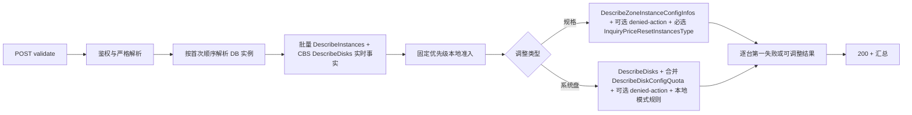
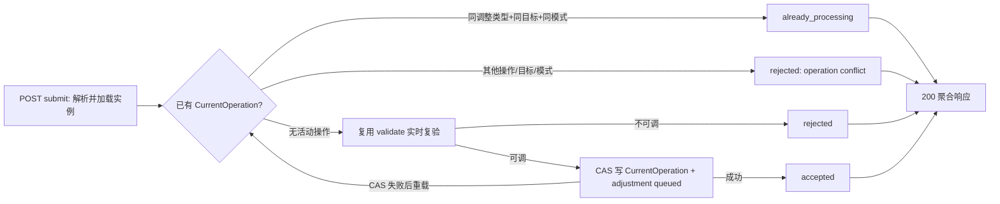
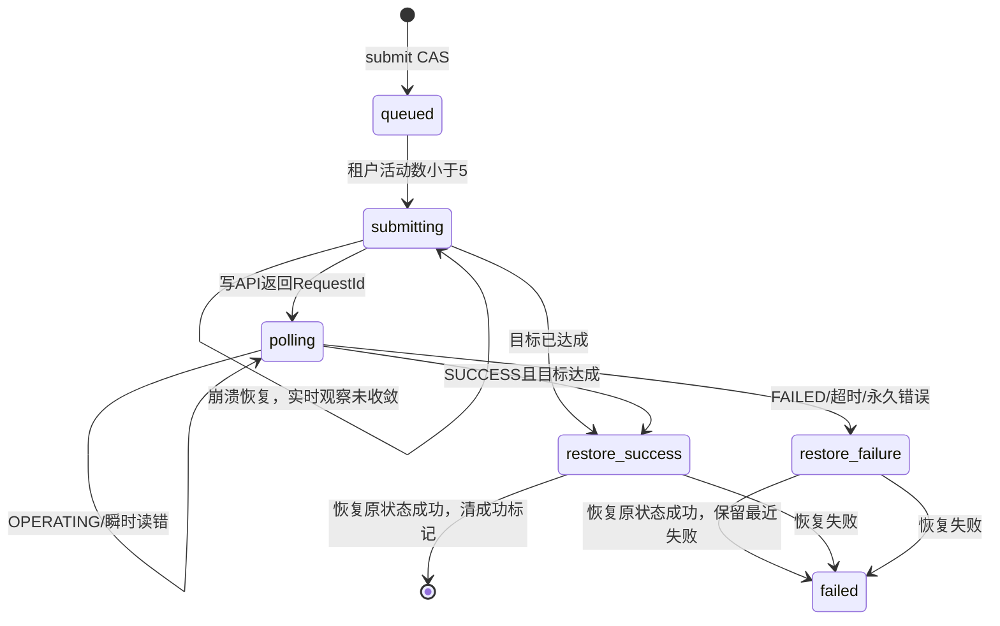
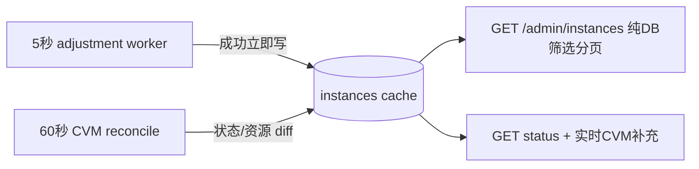

# 02. Plan — 方案设计

> 设计输入：[`01-clarify.md`](./01-clarify.md)。
>
> 本方案采用 clean cutover：不新增兼容接口、任务历史表或旧字段别名；两个新接口、资源缓存、调整状态机、操作锁和测试一次性完整落地。

---

## 设计结论

1. **实例行即最新操作真相源。** 不新增调整任务表；在 `instances` 上持久化云资源缓存、活动调整目标、云 RequestId、阶段、原始状态和最近失败。单实例同时只能有一个生命周期/资源调整操作，符合当前 `CurrentOperation` 模型。
2. **API 同步校验，worker 异步执行。** 校验与提交复验都读取实时 CVM/CBS 事实；提交只做实例级 CAS 锁定并返回受理结果。每租户 5 秒 worker 每轮最多推进 5 台，进程退出后可从 DB 恢复。
3. **主 Agent 状态复用 worker 观察结果。** 调整中 worker 本来就高频读取 CVM；同一次轮询落库顺带同步最近观察到的 `RUNNING/STOPPED`，不增加云调用，`actions=[]`；过渡态继续保留最近稳定状态。成功不保留成功标记。
4. **云资源列只读 DB。** 现有 60 秒 reconcile 扩展为回填规格、CPU、内存和系统盘；调整 worker 在既有轮询写中同步稳定状态，成功后立即写资源缓存。管理端列表不因新增字段退化为逐页调用云 API。
5. **锁从共享入口收口。** 生命周期入口通过 `setOperation*`/`canOperate`，运行态写入口通过 `requireActionAllowed*`/`requireInstanceRunning` 拒绝活动调整；批量命令、技能、插件、MCP、角色分发在目标解析后逐台调用同一纯 guard。
6. **最近失败只在下一次真正受理的变更时清除。** 参数错误、权限错误、状态拒绝和只读请求不清除；生命周期 CAS、单实例配置写和批量逐台受理点调用统一清理 helper。
7. **通过检查不等于绝对成功，但必须最小化误判。** 腾讯云没有 DryRun/库存或订单预留 API，因此采用 validate、submit、worker 首次云写前 JIT 三次完整校验；规格 JIT 询价成功、系统盘 JIT 本地规则通过后，立即使用同一规范化参数调用写 API，把不可避免的 TOCTOU 窗口压缩到最小。

## 固定对外契约

### 新接口

| 方法与路径 | 用途 | HTTP 语义 |
|------------|------|-----------|
| `POST /admin/instances/adjust-config/validate` | 实时校验 1～100 台实例 | 请求合法时固定 200；实例级不可调整进入 `results[]` |
| `POST /admin/instances/adjust-config` | 实时复验并部分受理 | 请求合法时固定 200；逐台返回 `accepted/rejected/already_processing` |

两个接口共用同一严格 JSON schema；以下分别是两个合法请求：

```json
{
  "ids": [1, 2],
  "adjustment_type": "instance_type",
  "target_instance_type": "Ai2.LARGE8"
}
```

```json
{
  "instance_ids": ["ins-xxx"],
  "adjustment_type": "system_disk",
  "target_system_disk_size": 100,
  "resize_mode": "online"
}
```

- `ids` 与 `instance_ids` 必须且只能提供一种；去重后 1～100 项，保留首次出现顺序。
- `adjustment_type=instance_type` 时只读取 `target_instance_type`。
- `adjustment_type=system_disk` 时只读取绝对容量 `target_system_disk_size` 和 `resize_mode=online|offline`。
- 停机语义不增加独立 flag：运行中规格升配自动停机；系统盘扩容严格按 `resize_mode=online|offline` 决定在线或停机；原本已关机的实例保持关机。
- 请求级 400 只用于权限/方法之外的 envelope 错误：非法 JSON、未知字段、错误 JSON 类型、ID 二选一/数量违规、非法 `adjustment_type`/`resize_mode`、当前类型缺少必填目标。已知但不属于当前 `adjustment_type` 的目标字段忽略。字段已存在且类型正确、但业务值无效（如容量 `<=0`、未知规格、同档或降配）必须进入逐实例 validator，不得整批 400。

校验响应：

```json
{
  "adjustable_count": 1,
  "non_adjustable_count": 1,
  "results": [
    {
      "id": 1,
      "instance_id": "ins-xxx",
      "current_instance_type": "Ai2.MEDIUM4",
      "current_system_disk_type": "CLOUD_BSSD",
      "current_system_disk_size": 50,
      "current_status": "running",
      "adjustable": true,
      "reason_code": "",
      "reason_message": "",
      "min_disk_size": 51,
      "max_disk_size": 500,
      "step_size": 1
    }
  ]
}
```

提交响应沿用相同当前值和原因字段，并增加：

```json
{
  "accepted_count": 1,
  "rejected_count": 1,
  "already_processing_count": 0,
  "results": [
    {
      "id": 1,
      "instance_id": "ins-xxx",
      "status": "accepted",
      "accepted": true,
      "already_processing": false,
      "reason_code": "",
      "reason_message": ""
    }
  ]
}
```

### 现有查询接口增量

`GET /admin/instances` 的 CVM 实例项新增：

| 字段 | 类型 | 说明 |
|------|------|------|
| `cvm_instance_type` | string | 当前 CVM 规格 |
| `cpu` | int | CPU 核数 |
| `memory_gb` | int | 内存 GiB |
| `system_disk_type` | string | 系统盘介质 |
| `system_disk_size` | int | 系统盘 GiB |
| `adjustment_status` | string | 空、`processing` 或 `failed` |
| `adjustment_type` | string | 最近活动/失败调整类型 |
| `adjustment_error_code` | string | 稳定产品错误码 |
| `adjustment_error_message` | string | 当前请求语言下的安全展示文案 |
| `adjustment_updated_at` | string/null | RFC3339 |

- 本地 Agent 不返回云资源或调整字段；提交准入在任何 CAS 前拒绝 local，并以 UT 保证 local 行永远不会产生 adjustment 元数据。
- 新增精确多值筛选：`cvm_instance_type=Ai2.MEDIUM4,Ai2.LARGE8`、`system_disk_size=50,100`；均下推到 SQL，多个值取 OR。
- 原 `agent_type` 继续表示 Agent 类型，不复用为 CVM 规格，避免破坏既有 API。
- 本仓库没有独立的 admin instance detail 路由；现有单实例 `GET /admin/instances/status` 即本期的云端 Agent 详情/status 接口。它保留 `state`，从实时 `DescribeInstances` 增量返回同一组云资源与调整展示字段；本地 Agent 仍按既有契约拒绝。

### 稳定原因码

准入按 Clarify 中固定优先级只返回第一条原因。实现集中维护以下稳定码，原始腾讯云错误只进入脱敏日志：

- `instance_not_found`
- `cloud_instance_required`
- `doctor_node_not_allowed`
- `operation_in_progress`
- `instance_status_not_supported`
- `cvm_instance_not_found`
- `cvm_restricted`
- `cvm_operation_in_progress`
- `cvm_query_failed`
- `stop_charging_not_supported`
- `invalid_target`
- `unsupported_instance_type`
- `instance_type_not_upgrade`
- `cloud_disk_required`
- `system_disk_type_not_supported`
- `target_instance_type_unavailable`
- `disk_quota_unavailable`
- `unsupported_charge_type`
- `disk_not_ready`
- `cloud_disk_unavailable`
- `instance_network_incompatible`
- `instance_resource_limit_exceeded`
- `instance_image_not_supported`
- `instance_feature_not_supported`
- `promotion_restricted`
- `invalid_disk_size`
- `online_resize_not_supported`
- `insufficient_balance`
- `unpaid_order`
- `resource_sold_out`
- `cloud_adjustment_failed`
- `adjustment_timeout`
- `adjustment_restore_failed`

## 改动文件清单

### 核心实现

| 文件 | 操作 | 计划改动 |
|------|------|----------|
| `controller/admin_instance_adjustment.go` | 新增 | 请求/响应类型、严格解析、目标解析、校验 handler、提交复验、实例级部分受理和幂等结果 |
| `controller/instance_adjustment_cloud.go` | 新增 | 可注入的 CVM/CBS gateway；`DescribeInstances`/`DescribeDisks` 实时事实；规格/磁盘准入；配额合并；规格必选询价与 best-effort denied-action 补充；按 action 的分布式云调用 gate；官方错误族稳定映射 |
| `controller/instance_adjustment_worker.go` | 新增 | 每租户单轮推进函数、最多 5 台并发、首次云写前完整 JIT 复验、云写调用、RequestId 轮询、超时、恢复原状态和终态落库 |
| `task/instance_adjustment_poller.go` | 新增 | 注册 5 秒、`PerTenant=true`、`NeedDistLock=true` 的 scheduler 任务 |
| `model/instance.go` | 修改 | 增加资源缓存和调整元数据字段；扩展 `InstanceStatusCacheItem` 与批量缓存写回 |
| `model/instance_lifecycle.go` | 修改 | 增加两种资源调整操作常量、900 秒超时和资源调整判定 helper；不加入主状态过渡映射 |
| `model/site_config.go` | 修改 | `AllowedInstanceTypes` 补齐 `Ai2.2XLARGE16`；新增固定有序 AI2 升配 rank helper，创建配置仍复用同一白名单 |
| `controller/instance_state.go` | 修改 | 扩展 `CVMInstanceInfo`；活动资源调整时按原稳定态返回主状态且清空 actions；不进入 `load_failed/upgrade_failed` |
| `controller/admin_instances.go` | 修改 | DescribeInstances 字段提取、列表响应/筛选、cached 与 legacy 两条路径、`/status` 资源详情 |
| `controller/status_reconcile.go` | 修改 | 对规格/CPU/内存/系统盘做 diff 回填；资源调整交给专用 worker，跳过通用操作超时/失败收敛 |
| `controller/instance_operation.go` | 修改 | delete 不得覆盖资源调整；所有 `setOperation*` 原子拒绝活动调整并在真正受理时清最近失败；增加资源调整 CAS/清理 helper |
| `controller/instance_status_guard.go` | 修改 | 三个共享 guard 统一拒绝活动资源调整并返回 409；提供批量入口复用的纯检查函数 |
| `controller/tencent_clients.go` | 修改 | 新增统一 `GetCBSClient(ctx)`，与 CVM 使用同一租户凭证和 Region |
| `controller/access_log.go` | 修改 | 增加 `SDKComponentCBS`；所有新增 SDK 调用走 `CallSDKAPITyped` |
| `controller/audit.go` | 修改 | 注册提交接口 `instance_adjust_config` 审计规则；校验接口是只读校验，不写审计 |
| `main.go` | 修改 | 注册两个路由；提交接口使用 `WithAudit(WithOpenAPI(...))`，校验接口使用 `WithOpenAPI(...)` |
| `i18n/keys.go` | 修改 | 新增参数校验、准入、云执行、恢复和锁冲突的中文 Key |
| `i18n/en.go` | 修改 | 为全部新增 Key 注册英文翻译 |
| `go.mod`、`go.sum` | 修改 | CVM SDK 从 `v1.3.48` 升到已核验的 `v1.3.130`（旧版 `Instance` 缺少 `LatestOperationErrorMsg`），增加 CBS SDK `v1.3.115`；不升级其他腾讯云模块 |

### 操作锁覆盖与失败标记清理

共享 guard/operation helper 覆盖大部分单实例调用；下列绕过共享锁或直接批量落任务的入口需要在目标解析后逐台补 guard，并只在该台真正受理时清除旧失败：

| 变更族 | 文件 |
|--------|------|
| 生命周期、管理员批量升级/检测 | `controller/admin_instances.go`、`controller/openclaw.go`、`controller/openclaw_reinstall.go`、`controller/openclaw_migration.go` |
| Agent 命令 | `controller/admin_agent_command_tasks.go` |
| 技能 | `controller/openclaw_skill.go`、`controller/admin_skill_distribution.go`、`controller/admin_skills.go` |
| 插件 | `controller/openclaw_plugin.go`、`controller/admin_plugins.go` |
| MCP | `controller/openclaw_mcp.go`、`controller/admin_mcp_distribute.go` |
| 模型、通道、环境、Gateway | `controller/openclaw_model.go`、`controller/openclaw_channel.go`、`controller/openclaw_env.go`、`controller/openclaw_gateway.go` |
| 角色 | `controller/openclaw_role_apply.go`、`controller/admin_roles.go`、`controller/admin_roles_distribute.go` |

只读接口（list、作为单实例详情的 `/admin/instances/status`、terminal URL 查询、安装状态查询）只展示或查询，不清失败标记。浏览器/VNC 等会改变实例软件或云资源的写操作继续经 `requireInstanceRunning` 自动受锁保护。

### Schema、测试与文档

| 文件 | 操作 | 计划改动 |
|------|------|----------|
| `sql/init.sql` | 修改 | 同步 `instances` 新字段和索引 |
| `sql/0728-resource-management.sql` | 新增 | 按 `Release/2026_07_28` 为现有 MySQL 增量增加资源策略及实例调整字段/索引 |
| `controller/admin_instance_adjustment_test.go` | 新增 | handler、准入顺序、部分受理、幂等、i18n |
| `controller/instance_adjustment_cloud_test.go` | 新增 | CVM/CBS 参数、配额合并、错误映射、字段提取 |
| `controller/instance_adjustment_worker_test.go` | 新增 | 状态机、崩溃窗口、轮询、超时、恢复、并发上限 |
| `task/instance_adjustment_poller_test.go` | 新增 | scheduler wrapper/seam |
| `controller/admin_instances_test.go` | 修改 | 列表资源字段、两条 list 路径、新筛选、状态 actions |
| `controller/status_reconcile_test.go` | 修改 | 存量回填、外部变更、竞态保护 |
| `controller/instance_operation_test.go`、`controller/instance_status_guard_cases_test.go` | 修改 | delete/共享 guard/失败清理契约 |
| `model/site_config_test.go`、`model/instance_lifecycle_test.go` | 修改 | 四档白名单、严格升配 rank、900 秒超时 |
| `controller/tencent_clients_test.go`、`controller/access_log_log_rcv_request_test.go` | 修改 | CBS 工厂和日志组件 |
| `controller/audit_integration_test.go` | 修改 | 提交接口审计规则 |
| `test/scripts/openclaw_instance/test_admin_instance_adjust_config.py` | 新增 | 部署环境 API 覆盖与真实 CVM 端到端链路 |
| `docs/API.md` | 修改 | 接口目录、两个新接口、list/status 字段与筛选、错误码和异步语义 |

## 数据库变更

不新增表；`instances` 增加下列字段。字符串与数值字段全部 `NOT NULL`，分别使用空串/0 默认；仅时间指针字段允许 `NULL`。GORM tags、`sql/init.sql` 和增量 migration 必须逐列保持该类型、空值、默认值与索引语义一致：

| 字段 | MySQL 类型 | 默认/索引 | 用途 |
|------|------------|-----------|------|
| `cvm_instance_type` | `varchar(64)` | `''`，索引 | 列表/筛选规格缓存 |
| `cvm_cpu` | `bigint` | `0` | CPU 核数缓存 |
| `cvm_memory_gb` | `bigint` | `0` | 内存缓存 |
| `system_disk_type` | `varchar(32)` | `''` | 系统盘介质缓存 |
| `system_disk_size` | `bigint` | `0`，索引 | 系统盘容量缓存 |
| `resource_synced_at` | `datetime(3)` | `NULL` | 云资源缓存同步时间与竞态保护 |
| `adjustment_status` | `varchar(16)` | `''`，索引 | 空/processing/failed |
| `adjustment_type` | `varchar(32)` | `''` | instance_type/system_disk |
| `adjustment_phase` | `varchar(32)` | `''` | queued/submitting/polling/restore_success/restore_failure |
| `adjustment_target_instance_type` | `varchar(64)` | `''` | 规格目标 |
| `adjustment_target_disk_size` | `bigint` | `0` | 系统盘绝对目标 |
| `adjustment_resize_mode` | `varchar(16)` | `''` | online/offline |
| `adjustment_original_cvm_state` | `varchar(32)` | `''` | 原 RUNNING/STOPPED |
| `adjustment_original_stop_charging_mode` | `varchar(32)` | `''` | 恢复关机时保留原计费模式 |
| `adjustment_request_id` | `varchar(64)` | `''` | 腾讯云写请求 ID |
| `adjustment_error_code` | `varchar(128)` | `''` | 最近产品化失败码 |
| `adjustment_error_message` | `varchar(512)` | `''` | 默认语言安全兜底文案，仅供运维/未知码兜底；对外响应不直接复用 |
| `adjustment_started_at` | `datetime(3)` | `NULL` | 固定 15 分钟总超时起点 |
| `adjustment_updated_at` | `datetime(3)` | `NULL` | 最近阶段/结果更新时间 |
| `adjustment_next_poll_at` | `datetime(3)` | `NULL`，索引 | 读取错误指数退避 |
| `adjustment_reconcile_count` | `bigint` | `0` | RequestId 落库前崩溃的保守观察计数 |

失败终态以 `adjustment_error_code` 为多语言真相源；validate/submit/list/status 每次响应时按当前请求语言经 i18n 重新渲染 `reason_message`/`adjustment_error_message`。持久化 message 只保存默认语言的安全通用文案，不保存腾讯云原始错误，也不决定响应语言。

索引只服务真实查询：

- 保留已有 `current_operation` 索引用于活动操作扫描。
- `adjustment_status` 支持失败/处理中展示和运维查询。
- `adjustment_next_poll_at` 支持 worker 取到期任务。
- `cvm_instance_type`、`system_disk_size` 支持管理列表精确筛选。
- 不给 RequestId、错误文案、目标字段建索引。

所有更新使用 `model.DB(ctx).Model(&model.Instance{})` 和参数化 GORM；不使用裸 SQL接口。仅 SQL schema/migration 文件包含 DDL。

## 调用链与数据流

### 校验



- `DescribeInstances` 每 100 台一批；无效 CVM ID 降级单台查询但不拖垮整批。提取状态、RestrictState、计费模式、StopChargingMode、规格/CPU/内存、zone、系统盘/数据盘、网络/镜像以及 LatestOperation*；只允许 `PREPAID`、`POSTPAID_BY_HOUR`，`SPOTPAID/CDHPAID/CDCPAID` 保守返回 `unsupported_charge_type`。
- CBS `DescribeDisks` 以 CVM 返回的全部云盘 ID 批量查询。系统盘扩容必须且只能找到一块与实例关联的 `SYSTEM_DISK`，并满足 `Portable=false`、`Attached=true`、`DiskState=ATTACHED`、`Migrating=false`、`Rollbacking=false`、无到期/计费异常；DiskId/类型/容量/计费模式以该实时对象为准。规格升配时所有本地盘直接拒绝，所有云盘必须已挂载、非迁移/回滚且状态正常。
- 每台实例严格按 Clarify #1～#13 短路执行，只返回第一条原因：目标业务值检查是第 #6 及以后，必须排在实例身份、活动锁、语义/实时状态、云实例事实和 `STOP_CHARGING` 之后；规格 SELL 与必选询价固定为 #9，只在 #1～#8 全部通过后执行，denied-action 仅作补充；系统盘 #10～#12 只在系统盘调整分支执行。某一步失败后不再调用该实例的后续必选云检查。
- 规格售卖校验以每台实例实时 `zone`、`InstanceChargeType` 和目标 `InstanceType`（含目标 CPU/Memory、AI2 family）查询 `DescribeZoneInstanceConfigInfos`，只接受完全匹配且 `Status=SELL` 的结果；缺失或非 SELL 固定返回 `target_instance_type_unavailable`。
- 规格执行支持盘集合按 `ResetInstancesType` 文档固定为 `CLOUD_BASIC/CLOUD_PREMIUM/CLOUD_SSD/CLOUD_BSSD`；之后仍必须通过 `InquiryPriceResetInstancesType`。询价文档未列 `CLOUD_BASIC`，若真实询价拒绝则保守判不可调，不绕过询价；这是有意接受的 false negative。
- CBS quota key 固定为实时 `(zone, instanceFamily, diskType, diskChargeType, cpu, memory, SYSTEM_DISK)`，单请求内相同 key 只查一次。先要求匹配行存在且 `Available=true`；令 `quotaMin=MinDiskSize`、`step=max(StepSize,1)`，有效容量满足 `size >= quotaMin && size <= MaxDiskSize && (size-quotaMin)%step==0`。响应 `min_disk_size` 是该集合中严格大于实时 DiskSize 的首个值，混合批次按各自容量计算。
- 系统盘写请求始终只设置 `SystemDisk{DiskId, DiskSize}`，`DataDisks` 必须为空；目标严格大于 `DescribeDisks.DiskSize`。RUNNING+online 固定 `ResizeOnline=true,ForceStop=false`，RUNNING+offline 固定 `false,true`，STOPPED 固定 `false,false`，禁止构造 RUNNING 下两者都 false 的请求。
- `DescribeInstancesDeniedActions` 复用 `admin_instances.go` 现有 `CommonRequest("cvm", "2017-03-12", "DescribeInstancesDeniedActions")` helper，仅作为 best-effort 补充：成功且明确返回对应 action denied 时逐台拒绝；action 不可用、不支持或调用失败时只记脱敏日志。规格分支继续执行必选 InquiryPrice，系统盘分支继续按实时事实、配额和模式规则判定。
- denied-action 明确拒绝、规格必选询价拒绝以及写 API 残余错误都映射为唯一稳定原因。余额/未支付订单、库存、基础网络、ENI/EIP 数量、带宽、镜像/RedHat、ARM/异构/跨族、swap/local/migrating disk、特殊机型、促销/applicationRole/EMR 等官方错误族，按“可见字段确定性检查 → best-effort denied-action → 规格必选 InquiryPrice 或系统盘本地规则 → 写 API 残余错误”的顺序覆盖，不允许未映射错误原样透传。
- 规格 Inquiry 和 write 由同一个规范化 operation 对象构造；系统盘不调用 InquiryPriceResizeInstanceDisks，write 直接使用同一规范化 operation 中的 DiskId、DiskSize、ForceStop 与 ResizeOnline。询价价格丢弃。
- 为避免并发请求自触发限流，validate、submit 和 worker JIT/写调用共用按 `UIN+region+action` 命名的分布式云调用 gate，且每个 action 无 burst：`ResetInstancesType`、`InquiryPriceResetInstancesType`、`ResizeInstanceDisks` 各自最多 8 QPS（官方各 10 QPS）；CBS `DescribeDiskConfigQuota` 最多 15 QPS（官方 20 QPS）；CBS `DescribeDisks` 及其他只读 action 使用独立、可配置且默认 8 QPS 的保守 gate，不宣称低于未经核验的官方上限。它不使用 package-level 可变 limiter；瞬时限流仍按现有 cloud retry 退避。
- 只有凭证/client 创建失败或整次云基础设施不可用升级为接口级 5xx；单实例、单 quota condition、denied-action、规格询价或系统盘本地校验失败只影响对应实例。
- SDK 归属固定：`GetCBSClient` 调用 CBS `DescribeDisks`、`DescribeDiskConfigQuota`；`GetCVMClient` 调用 CVM `DescribeInstances`、`DescribeZoneInstanceConfigInfos`、`InquiryPriceResetInstancesType` 及 `ResetInstancesType`/`ResizeInstanceDisks`。已核验 CBS `v1.3.115` 和 CVM `v1.3.130` 均包含这些必选接口的强类型 request/response；`DescribeInstancesDeniedActions` 明确沿用现有 CommonRequest，不假设 SDK 存在强类型方法。

#### 腾讯云常见阻断覆盖

| 常见情况 | 首选检查 | 结果 |
|----------|----------|------|
| CVM 非稳定态、隔离、救援/热迁移、云侧操作中 | `DescribeInstances` 状态/Restrict/LatestOperation + best-effort denied-action；规格分支再询价 | 逐台拒绝 |
| STOP_CHARGING、SPOT/CDH/CDC 等未支持计费 | `StopChargingMode`、Instance/DiskChargeType | 逐台拒绝 |
| 系统盘非云盘、数据盘本地盘、盘迁移/回滚/异常 | `DescribeInstances` + `DescribeDisks` | 逐台拒绝 |
| 系统盘可携带、未挂载、挂错实例、非 SYSTEM_DISK | `DescribeDisks` | 逐台拒绝 |
| 同容/缩容、超过 max、低于 min、不符合 step、quota 不可售 | 实时 DiskSize + `DescribeDiskConfigQuota` | 逐台拒绝 |
| 目标规格非 AI2 严格升配或 zone/计费下非 SELL | rank + `DescribeZoneInstanceConfigInfos` | 逐台拒绝 |
| 基础网络、ENI/EIP 数量、带宽、镜像/RedHat、ARM/异构/跨族 | 必选规格询价；denied-action 仅作补充 | 询价/拒绝原因产品化 |
| swap、特殊/活动机型、促销、applicationRole/EMR | best-effort denied-action + 规格必选询价；系统盘无可见字段覆盖时保留为写时残余风险 | 不伪造“已保证” |
| 余额不足、未支付订单、规格库存售罄 | 规格必选 InquiryPrice；worker JIT 重复 | 逐台拒绝 |
| 系统盘执行期在线能力、余额或订单变化 | 本地事实/配额/模式规则通过后调用真实 ResizeInstanceDisks | 执行拒绝映射稳定原因，不自动降级 |

### 提交与实例级 CAS



- submit 在实时复验前先识别已有活动操作：同类型、同目标且同扩容模式直接返回 `already_processing`；不同目标、模式或其他操作返回逐台冲突。validate 没有幂等受理语义，看到任何活动操作都返回 `operation_in_progress`。
- 仅没有活动操作的实例进入共享实时 validator；通过全部云侧准入后直接进入 CAS，不再增加停机确认门禁。
- CAS 条件包含租户过滤、实例主键和 `current_operation=''`；CAS 失败必须重新加载并按同目标幂等/不同目标冲突重新分类。
- 写入 `LastStableState`/原始 CVM 状态、目标、模式、开始时间，并清除旧失败字段；同目标处理中不改更新时间、不重复入队。
- 受理完成即由 scheduler 在下一轮获取，不启动请求级 goroutine，HTTP 结束不持有 `r.Context()`。

### Worker 状态机



每轮逻辑：

1. 在 tenant 分布式锁内统计 `submitting/polling/restore_*` 活动数；不足 5 时按 `id` 把最早 queued 任务补到 5。
2. 最多 5 个 goroutine 各推进一个持久化阶段，不在单次 tick 内阻塞等待 15 分钟；所有云调用还要经过前述 `UIN+region+action` 分布式 gate 和无 burst cadence。
3. `submitting` 在**首次云写前**执行完整 JIT validator。它允许当前实例持有与自身任务完全相同的 adjustment lock，但重新获取 `DescribeInstances`、`DescribeDisks`、quota/SELL 和 best-effort denied-action；规格分支执行对应必选询价，系统盘分支执行本地事实/配额/模式规则。通过后立即用同一规范化 operation 发起写 API。JIT 失败则不调用写 API，直接按稳定原因终态失败。
4. 进程在 API 受理与 RequestId 落库之间退出时，下轮先看目标值、`LatestOperation`、`LatestOperationState` 和 `LatestOperationRequestId`；只有连续 **3 次**成功 `DescribeInstances`、每次间隔不少于 **5 秒**、均确认目标未达成且无相关 `OPERATING`/最新操作时，才进入“可能首次写”路径。读取失败不累计，发现相关操作立即清零；三次观察后仍必须重新执行完整 JIT validator，不能直接重放。
5. RequestId 已存在后绝不重放写 API；优先匹配 `LatestOperationRequestId`，不匹配时继续等待。RequestId 暂未回显时同时检查目标事实和相关最新操作。CVM SDK `v1.3.130` 的 `LatestOperationErrorMsg` 只进脱敏日志/内部映射，不原样返回。
6. 读取/轮询瞬时错误按 1s、2s、4s、8s、最多 30s 的 `next_poll_at` 退避；`adjustment_started_at + 15m` 是不可延长的总超时。
7. 规格升配调用 `ResetInstancesType`；系统盘调用仅带 `SystemDisk` 的 `ResizeInstanceDisks`。参数固定：

| 场景 | 云写参数 | 恢复条件 |
|------|----------|----------|
| 规格，原运行 | `ForceStop=true` | 最终 RUNNING |
| 规格，原关机 | `ForceStop=false` | API 成功自动运行后，按原 stop charging mode 停回 STOPPED |
| 系统盘在线，原运行 | `SystemDisk={DiskId,DiskSize}, ResizeOnline=true, ForceStop=false` | 最终 RUNNING，不主动启停 |
| 系统盘离线，原运行 | `SystemDisk={DiskId,DiskSize}, ResizeOnline=false, ForceStop=true` | 最终 RUNNING |
| 系统盘，原关机 | `SystemDisk={DiskId,DiskSize}, ResizeOnline=false, ForceStop=false` | 最终 STOPPED，保留原 stop charging mode |

8. 成功时用单次条件更新写资源缓存、清 `CurrentOperation` 和 adjustment 元数据；失败时先尽力恢复，再清活动锁并保留失败码/文案/时间。
9. 恢复失败时以实时 CVM 稳定态更新主状态缓存，错误固定为 `adjustment_restore_failed`，不得伪造原状态。

### Reconcile 与列表



- `resource_synced_at` 使用与 `status_synced_at` 相同的“本轮开始时间”竞态保护，避免 60 秒 reconcile 覆盖 worker 刚写的新规格/容量。
- 存量实例在部署后 5 秒启动的首轮 reconcile 自动回填，无需一次性迁移任务。
- 控制台外调整也在后续 reconcile 回填。

## 操作锁覆盖策略

### 活动锁

- `CurrentOperation` 新值：`adjust_instance_type`、`adjust_system_disk`。
- 资源调整活动时：
  - `ResolveInstanceStatus` 返回保存的原 `running/stopped` 主状态；
  - list/status 的 `actions=[]`；
  - `canOperate` 对包括 delete 在内的生命周期操作返回 409；
  - `setOperation` 的 delete 覆盖例外仅保留给非资源调整操作；
  - `requireActionAllowedForUser/Admin`、`requireInstanceRunning` 在读取状态 map 前先拒绝；
  - 批量目标解析返回逐台冲突，不影响批次内其他实例。

### 最近失败覆盖

统一 helper 分为两步：

1. `ensureNoActiveAdjustment(instance)`：纯检查，可在所有预检阶段使用，不改 DB。
2. `clearFailedAdjustmentOnAccept(db, instanceID)`：仅在请求其余校验全部通过、准备执行首个实际写入时调用。

`setOperation*` 把第二步合并到同一条件 UPDATE，避免“旧失败已清但新操作未锁定”的窗口。直接写 Agent 配置/关联表的 handler 在事务内先清失败再写业务数据；批量下发逐台处理。

## 测试用例设计（自然语言描述）

> Implement 阶段严格按本节编码；UT 使用 fake cloud gateway，不访问真实腾讯云。真实账号、库存、扣费和状态回传只放 IT。

### 单元测试（UT）

| # | 场景 | 输入 | 预期输出 | 级别 |
|---|------|------|---------|------|
| U01 | 鉴权、方法和严格 JSON | 非管理员、GET、非法 JSON、未知字段 | 分别 401/403、405、400、400；不查云、不写 DB | P0 |
| U02 | ID 互斥、数量、去重和顺序 | 两组同传、空、101 项、重复 IDs | 非法请求 400；合法请求去重并保持首次顺序 | P0 |
| U03 | 请求 envelope 与目标业务值分界 | 缺少必填目标、已知无关字段、非法 mode、JSON 类型错误、容量 `<=0`、未知规格 | 缺失/非法 enum/类型错误返回 400；已知无关字段忽略；类型正确但业务无效的值按固定优先级进入逐台 `invalid_disk_size`/`unsupported_instance_type` 等原因 | P0 |
| U04 | 四档 AI2 严格升配 | 每个当前档位配低/同/高/未知目标 | 仅固定序列内严格更高可调；`2XLARGE16` 无更高目标 | P0 |
| U05 | 第一失败优先级 | 同一实例同时为 local、忙、状态错、目标错 | 每次只返回优先级最高的稳定 reason_code | P0 |
| U06 | 实时状态准入 | RUNNING、STOPPED、过渡态、RestrictState、STOP_CHARGING | 前两者继续；其余按固定码拒绝 | P0 |
| U07 | 规格磁盘兼容 | 本地盘、混合盘、不支持系统盘类型 | 规格升配拒绝并返回对应稳定码 | P0 |
| U08 | 规格售卖、best-effort denied-action 与必选无副作用询价 | 不同 zone/计费模式/目标 CPU-Memory 下的 SELL/非 SELL；denied 明确拒绝、action 不可用/调用失败；询价成功/失败 | SELL 完全匹配后始终执行询价；明确 denied 直接拒绝；denied-action 不可用/失败时回退必选询价，只有询价成功才可调；价格不进响应 | P0 |
| U09 | CBS quota 合并 | 100 台含重复/不同 quota key | 相同 key 只调用一次；不同 key 独立；单 key 失败只影响关联实例 | P0 |
| U10 | 容量边界和混合批次 | 小于等于当前、低于 quotaMin、超过 max、`(target-quotaMin)%step!=0`、部分实例可调 | 逐台计算首个有效 `min_disk_size` 并校验离散容量集合；合法实例不被其他实例拖累 | P0 |
| U11 | 在线/离线模式 | 运行、关机、在线写不支持 | 本地规则生成三种 operation，系统盘询价为零；在线写同步拒绝映射稳定码且不降级 | P0 |
| U12 | 校验部分结果 | 可调、不可调、CVM 不存在混合 | HTTP 200，计数准确，顺序不变，每台单一原因 | P0 |
| U13 | 提交复验部分受理 | 校验后库存/状态变化 | 仅仍可调实例 CAS accepted，其余 rejected，整批不失败 | P0 |
| U14 | 停机语义直接派生 | 运行/关机规格、运行在线/离线磁盘均不带确认字段；旧字段输入 | 合法场景直接 accepted 且按状态/resize mode 派生停机行为；旧字段作为 unknown field 返回 400 | P0 |
| U15 | 提交幂等与冲突 | 同目标处理中、不同目标、其他操作处理中 | already_processing 不改时间/不重复写；冲突逐台返回 | P0 |
| U16 | 并发 CAS | 两请求同时受理同一实例 | 只有一个 accepted；另一个幂等或冲突；无重复云任务 | P0 |
| U17 | 调整中真实稳定状态 | 原 running/stopped 的活动调整，实时 CVM 处于 STOPPING/STOPPED/STARTING/RUNNING | 稳定态展示真实 STOPPED/RUNNING，过渡态保留最近稳定值，actions 为空，adjustment_status=processing | P0 |
| U18 | delete 和共享 guard | 资源调整中调用 delete/start/reboot/config | 全部 409；delete 不覆盖资源调整锁 | P0 |
| U19 | 批量绕过入口 | 命令/技能/插件/MCP/角色批次混合锁定与普通实例 | 锁定项逐台拒绝，普通项继续受理 | P0 |
| U20 | 最近失败清理时机 | 只读、参数错误、状态拒绝、真正受理写 | 前三者保留；真正受理原子清理后执行 | P0 |
| U21 | Worker 并发上限 | 12 条 queued | 单轮最多 5 个进入活动执行；后续终态释放槽位 | P0 |
| U22 | 运行实例规格成功 | Reset 返回 RequestId，轮询 OPERATING→SUCCESS | 参数 ForceStop=true；目标缓存立即更新；最终 running；锁和成功标记清除 | P0 |
| U23 | 关机实例规格成功 | 原 STOPPED，Reset 成功后 RUNNING | ForceStop=false；worker 按原模式停回 STOPPED 后成功 | P0 |
| U24 | 系统盘三种执行路径 | 运行在线、运行离线、原关机 | ResizeOnline/ForceStop 组合准确，最终状态分别保持 | P0 |
| U25 | RequestId 正常轮询 | 最新 RequestId 匹配/不匹配/暂缺 | 匹配才消费终态；不匹配继续等；暂缺结合目标值保守判断 | P0 |
| U26 | RequestId 落库前崩溃 | phase=submitting、RequestId 空、云侧目标已达/操作中/无痕迹 | 收敛成功/继续轮询；仅 3 次成功观察且间隔均 ≥5 秒后允许云写，读错不累计，空 ID 不直接重放 | P0 |
| U27 | 云写已返回 RequestId | 后续 Describe 瞬时错误 | 只退避读，不再次调用 Reset/Resize | P0 |
| U28 | 超时边界 | started_at 距今 14:59 与 15:00 | 前者继续；后者进入失败恢复，退避不能延长总超时 | P0 |
| U29 | 云调整失败但恢复成功 | FAILED/余额不足/库存不足，原运行或关机 | 恢复原状态、清活动锁、缓存原值、持久化产品错误 | P0 |
| U30 | 状态恢复失败 | 调整成功或失败后 Start/Stop 失败 | 返回实时稳定态，`adjustment_restore_failed`，不伪造原状态 | P0 |
| U31 | Reconcile 资源回填 | 缓存空、云侧规格/盘变化、API_ERROR | 正常时 diff 写回；API_ERROR 保留旧值；worker 新写不被旧轮覆盖 | P0 |
| U32 | 列表字段与筛选 | CVM/local 混合，规格/容量多值筛选 | CVM 字段正确、local 省略、SQL 总数/分页/stats 一致 | P0 |
| U33 | 单实例详情/status 兼容 | CVM 实例实时信息、本地实例 | `/admin/instances/status` 保留 state 并增加资源/调整字段；本地仍按原契约拒绝；只读不清失败 | P1 |
| U34 | i18n | 同一原因使用 zh/en 请求 | reason_message 对应语言，Key 与英文注册一一齐全 | P0 |
| U35 | 审计与日志 | validate/submit、CVM/CBS 调用含敏感错误 | 只有 submit 写 audit；SDK 组件/RequestId/实例记录齐全；密钥和原始敏感信息不落响应 | P0 |
| U36 | schema 同步 | AutoMigrate、`sql/init.sql`、增量 migration | 字段类型/默认/索引一致；无新 model/allModels 迁移覆盖项 | P0 |
| U37 | DescribeDisks 确定性门禁 | 找不到盘、非 SYSTEM_DISK、Portable、未挂载/挂错实例、非 ATTACHED、Migrating/Rollbacking、DiskSize 漂移、计费异常 | 对应实例在 quota/规格询价/写 API 前被稳定原因拒绝 | P0 |
| U38 | Reset 官方常见错误族映射 | 基础网络、ENI/EIP、带宽、镜像/RedHat、ARM/异构/跨族、swap/local、特殊/spot/促销/applicationRole/EMR、余额/订单/库存 | 每个错误都映射为既定产品 reason；原始错误只入脱敏日志 | P0 |
| U39 | Resize 官方常见错误族映射 | 不支持计费、盘不可用、实例隔离/救援/热迁移/操作中、无效盘、余额/订单 | 每个错误逐台拒绝或失败，批次其他实例继续 | P0 |
| U40 | Worker 首写前 JIT | submit 后状态/库存/quota/盘状态/余额变化，及三次无痕迹后的可能重放 | 重新完整复验；失败不调用写 API；规格询价与写目标一致，系统盘无询价且规范化 operation 与写参数一致 | P0 |
| U41 | 分布式 action gate 与 QPS | 同 UIN/region 并发 validate、submit、worker；同/不同 action；不同 UIN/region | 同 `UIN+region+action` 无 burst：三条调整/询价 action 各自 ≤8QPS、quota ≤15QPS、DescribeDisks 默认 ≤8QPS；不同 key 可并行；无 package-level 可变 limiter | P0 |

### 集成测试（IT）

| # | 场景 | 输入 | 预期输出 | 级别 |
|---|------|------|---------|------|
| I01 | 两个路由认证与参数覆盖 | 无认证/坏 token/普通用户；分别用 `ids`、`instance_ids` 和两类 adjustment 全字段 | 401/403；路由与全部新增 body 参数进入覆盖报告 | P0 |
| I02 | 非法/部分校验 | local、未知 ID、合法 CVM、非法目标混合 | 200 部分结果，固定优先级原因，顺序与计数正确 | P0 |
| I03 | 运行实例规格升配 | 专用可销毁实例，从当前档升到下一档并确认停机影响 | accepted→processing→完成；最终运行、规格缓存/实时详情更新 | P0 |
| I04 | 关机实例规格升配 | 将同一专用实例停机后升到下一档 | API 自动运行后 worker 停回原关机状态，规格更新 | P0 |
| I05 | 在线系统盘扩容 | 运行实例，目标为 quota step 对齐的下一容量 | 全程最终运行，容量更新，不触发离线降级 | P0 |
| I06 | 离线系统盘扩容 | 运行实例，`resize_mode=offline`、确认强停 | 调整后恢复运行，容量更新 | P0 |
| I07 | 原关机系统盘扩容 | STOPPED 实例再扩一个 step | 最终仍 STOPPED，容量更新，关机计费模式不变 | P0 |
| I08 | 调整中操作锁 | processing 窗口调用 stop/delete/命令或技能写 | 全部 409；只读 list/status 仍成功且 actions 为空 | P0 |
| I09 | 幂等提交 | processing 窗口重复同目标，再提交不同目标 | 前者 already_processing 且 RequestId 不变；后者 conflict | P0 |
| I10 | list/status 增量 | 调整前后用 `cvm_instance_type`、`system_disk_size` 筛选并查 status | 字段、总数、分页和实时详情一致；新 query 参数命中覆盖 | P0 |
| I11 | 真实账号规格兼容 | 对各实际可用区校验 `Ai2.2XLARGE16` | 返回真实 SELL/库存结果，不因 SDK 字段缺失或解析失败报错 | P0 |
| I12 | 真实账号盘事实与配额 | 对实际系统盘执行 DescribeDisks，并对 BSSD 及账号实际存在的 HSSD 等类型查询 quota | 正确解析盘归属/Portable/State/计费及 Available/Min/Max/Step；不支持项产品化拒绝 | P0 |
| I13 | RequestId 回传时序 | 记录 Reset/Resize 后连续 Describe 的 LatestOperation* | worker 在实际回传顺序下正确收敛；缺失窗口不重放写 API | P0 |
| I14 | 审计与失败展示 | 提交后查操作记录；用可控不支持目标触发执行失败 | audit 存在；失败跨刷新保留；下一次成功受理变更后清除 | P1 |
| I15 | 增量 API 覆盖 | `make openapi` + 指定脚本生成 report | 两个新 operation、list 新 query 和全部新 body 参数无未覆盖项 | P0 |
| I16 | 校验 operation 与写接口一致性 | 运行和关机系统盘分别验证本地生成的 ForceStop/ResizeOnline/DiskId/Size 后执行；账号有条件时覆盖 CLOUD_BASIC 规格询价 | 系统盘无价格询价且校验 operation 与真实写请求一致；记录真实终态和 CLOUD_BASIC 规格询价行为 | P0 |

IT 使用单个专用、可销毁的最小 AI2 实例按“运行规格→关机规格→运行在线盘→运行离线盘→关机盘”顺序递增验证，避免为不可逆升配/扩容重复创建资源；`finally` 必须销毁实例。余额不足/未支付订单、15 分钟超时、恢复 API 失败和账号不存在的盘类型无法安全稳定制造，由 fake-cloud UT 覆盖映射。

## 验证命令

Implement 完成后的首轮 smoke 只跑新增/受影响包：

```bash
go test ./model -run 'Test(AllowedInstanceTypes|InstanceTypeUpgrade|OperationTimeout)' -count=1
go test ./controller -run 'Test(HandleAdminInstanceAdjust|InstanceAdjustment|AdminInstances.*(Resource|Filter)|.*AdjustmentLock)' -count=1
go test ./task -run 'TestInstanceAdjustmentPoller' -count=1
```

UT 阶段再执行 race、增量覆盖和静态检查：

```bash
go test ./model ./controller ./task -race -count=1
go vet ./...
BASE_BRANCH=origin/master bash .ci/ci-check-coverage.sh
```

IT 阶段：

```bash
make openapi BASE_BRANCH=origin/master
make test IMAGE=<镜像> BASE_BRANCH=origin/master \
  TEST_ARGS="--run openclaw_instance/test_admin_instance_adjust_config.py --report-dir ./test-report --ak <AK> --sk <SK>"
```

## 风险评估

| # | 风险 | 概率 | 影响 | 缓解与验证 |
|---|------|------|------|------------|
| R1 | 云写已受理但 RequestId 未落库即退出 | 中 | 重复扣费/重复操作 | submitting 预写、目标/最新操作双重收敛、3 次且间隔 ≥5 秒无痕迹才允许写；U26 + I13 |
| R2 | 规格 API 成功后自动开机破坏原关机状态 | 高 | 业务/计费状态改变 | 持久化原状态和 stop mode，成功终态前停回；U23 + I04 |
| R3 | 恢复原运行/关机状态失败 | 中 | 主状态错误、业务中断 | 独立 restore phase、实际状态回填、专用错误码；U30 |
| R4 | 多副本或重复提交产生并行操作 | 中 | 云操作冲突 | tenant dist lock + 实例 CAS + 同目标幂等；U15/U16 |
| R5 | 批量验证触发 CVM/CBS 限流 | 中 | 校验延迟/部分失败 | 批量 Describe、quota key 合并、按 `UIN+region+action` 分布式 gate；三条调整/询价 API 各 ≤8QPS、quota ≤15QPS，DescribeDisks 默认保守 ≤8QPS；瞬时退避；U41 |
| R6 | 60 秒 reconcile 覆盖 worker 新缓存 | 中 | 列表短时显示旧值 | `resource_synced_at` 条件更新；U31 |
| R7 | 活动调整时仍有旁路写入口 | 中 | 状态机被破坏 | 共享四 guard + 批量目标 guard + 绕过入口清单；U18/U19 |
| R8 | 最近失败被只读或无效写误清 | 中 | 用户无法排障 | 纯检查与 accept 清理分离；U20 |
| R9 | 真实账号/可用区不售卖 8C16G 或盘类型无 quota | 中 | 个别实例不可调 | 实时 SELL/quota 返回逐台不可调；I11/I12，不做静态假设 |
| R10 | 新字段影响大表 DDL | 中 | 部署锁表/耗时 | 仅定长小字段、nullable 时间字段、常量默认和必要索引；三处 schema 完全一致，IT 前在同规模 MySQL 演练 migration |
| R11 | 单实例 IT 不可逆升配/扩容 | 高 | 测试资源污染/成本 | 专用实例按递增顺序复用，禁止使用业务实例，finally 强制清理 |
| R12 | 校验通过后写 API 仍因能力、库存、余额或状态瞬变失败 | 中 | “检查通过但执行失败” | submit 后 worker 首写前完整 JIT，规格询价/系统盘本地规则通过后立即写；云侧无 DryRun/预留，残余 TOCTOU 明确保留而不承诺 100% |

## 实现顺序

1. Schema/model、四档规格 rank、CVM info 映射和 reconcile 资源缓存。
2. 可注入 cloud gateway、DescribeDisks/官方错误覆盖、分布式 QPS gate 与纯校验器，先让 validate handler 的全部 UT 通过。
3. 提交实例级 CAS、worker 观察状态同步和全局操作锁。
4. Worker 状态机、首写前 JIT、scheduler、恢复/失败收敛及崩溃窗口 UT。
5. list/status 字段与筛选、审计/i18n/SDK 日志。
6. 按绕过入口清单补批量锁与失败清理，运行 focused smoke。
7. 请求功能 smoke 通过后再进入 UT、Docs、IT 阶段的完整验证与产物更新。

## Plan 完成判定

- Clarify 的所有固定规则均有落点：API、schema、状态机、操作锁或测试。
- 无未决产品/实现契约问题。
- 仅保留必须在真实账号验证的运行时差异：`Ai2.2XLARGE16` 售卖状态、账号实际盘类型/quota、LatestOperationRequestId 回传时序、真实 ResizeInstanceDisks 的在线执行能力、InquiryPriceReset 对 CLOUD_BASIC 的行为；规格未知即保守拒绝，系统盘执行拒绝映射为稳定原因且不自动降级，由 I11～I13/I16 覆盖。

## 2026-07-22 Plan 修订：系统盘不再询价

- 删除系统盘路径的 `InquiryPriceResizeInstanceDisks` 调用及其 action gate；`InquiryPriceResetInstancesType` 仅服务规格升配。
- 系统盘准入保留实时 `DescribeInstances`、`DescribeDisks`、`DescribeDiskConfigQuota`、DeniedAction、容量边界和模式构造。
- 校验通过后保存同一个规范化 `adjustmentOperation`，JIT 重算后直接构造 `ResizeInstanceDisks`。
- 没有单独的在线能力 API；在线写被云端同步拒绝时映射 `online_resize_not_supported`，异步失败仍恢复真实状态且不降级为停机扩容。
- 对应测试必须断言系统盘 validate/JIT 不产生 `InquiryPriceResizeInstanceDisks` 请求，规格升配询价保持不变。
