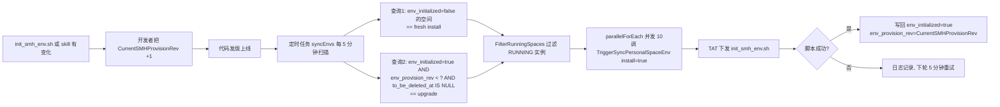

# SMH Skill 存量 CVM 自动升级方案

> **状态**：设计评审中
> **作者**：zhishzhang
> **日期**：2026-04-29
> **关联脚本**：[scripts/init_smh_env.sh](../scripts/init_smh_env.sh)
> **关联模块**：[controller/smh.go](../controller/smh.go)、[task/personal_space.go](../task/personal_space.go)、[model/smh_space.go](../model/smh_space.go)

---

## 1. 背景

`tencent-agent-storage` skill 通过 [init_smh_env.sh](../scripts/init_smh_env.sh) 脚本以 TAT 方式下发到 CVM 实例，脚本内部执行：

```bash
skillhub --dir "$SKILL_DIR" install "{{skill_name}}" --force
```

`skillhub install --force` 天然等价于 "安装或升级到 skillhub 上架的最新版"，因此**升级存量 CVM 的本质就是让 `init_smh_env.sh` 在这些实例上再跑一次**。

当前线上已通过 `init_smh_env.sh` 给大量 CVM 装过 skill。随着 skill 或脚本本身迭代，需要一个机制把这些存量 CVM 上的 skill/环境平滑升级到最新版本。

## 2. 现状梳理

### 2.1 触发 `TriggerSyncPersonalSpaceEnv(ctx, space, true)` 的全部入口

代码里把 skill 安装/升级行为收敛在 `TriggerSyncPersonalSpaceEnv(..., install=true)`，真实触发点如下：

| 位置 | 所在函数 | 真实语义 |
|------|----------|----------|
| `controller/openclaw.go` 新建实例分支 | 创建实例时自动开通网盘 | 每个新实例触发一次 |
| `controller/admin_smh.go` `createPersonalSpaceAndInitEnv` | 管理员 `enable` + 该实例此前无空间 → 新建空间后异步触发 | 每次开通触发 |
| `controller/admin_smh.go` `enableInstancePersonalSpace` 回收站恢复分支 | 用户/管理员**恢复**网盘时触发 | 每次恢复触发 |
| `task/personal_space.go` `syncEnvs()` | 5 分钟定时扫描 | **仅扫描 `env_initialized=false` 的空间** |

另有反向（卸载）路径 `TriggerSyncPersonalSpaceEnv(..., install=false)`：
- `disableInstancePersonalSpace`（停用网盘时触发）
- `syncEnvs()` 的 `toUninstall` 分支

卸载路径不属于"升级"语义，但会影响 `env_initialized` 的状态流转，下文会单独说明。

### 2.2 升级不到存量实例的根因

`syncEnvs()` 的 install 查询条件是：

```go
model.DB.Where("env_initialized = ? AND to_be_deleted_at IS NULL", false).Find(&toInstall)
```

所有已经装过 skill 的实例 `env_initialized=true`，定时扫描器永远不会再 touch 它们 —— **这是存量 CVM 无法自动升级的关键**。

### 2.3 复用现有扫描器的可行性

`task/personal_space.go` 的基础设施已经非常完备，可以直接复用：

- `parallelForEach` 并发度 10
- `FilterRunningSpaces` 过滤 RUNNING 的 CVM，离线实例自动跳过
- `TriggerSyncPersonalSpaceEnv` 里 `tryAcquireWithLock` 按 `space.InstanceId` 做 inflight 去重（进程内 `sync.Map` + MySQL 分布式锁）
- `SyncPersonalSpaceEnv` 单轮失败不会污染状态，下一轮定时任务自动重试

## 3. 方案设计

### 3.1 核心思路

引入 **provision revision（下文简称 rev）** 概念：

- 硬编码一个常量 `CurrentSMHProvisionRev`，**每当 `init_smh_env.sh` 或 `tencent-agent-storage` skill 需要强制存量 CVM 重装时就把这个常量 +1，并随代码发版上线**。
- `SMHPersonalSpace` 表新增字段 `env_provision_rev`，记录当前实例上已经装到哪一版。
- `syncEnvs()` 的 install 扫描拆成"新装"和"升级"两条查询，日志和索引都更干净。
- `SyncPersonalSpaceEnv` install 成功后一次性把 `env_initialized=true` 与 `env_provision_rev=CurrentSMHProvisionRev` 一并写回。

### 3.2 为什么不用 skill 版本号而用 provision rev

- `skillhub install --force` 每次都装 skillhub 最新版，**skill 版本号对 hatchery 来说不可见也不需要关心**。
- rev 语义上表达的是 "hatchery 希望存量 CVM 重走一次 init 的时机"，可以覆盖：
  - skill 升级（需要 `skillhub install --force` 刷新）
  - `init_smh_env.sh` 自身改动（新增 env、修 bug、加兼容处理）
  - 未来 skill 依赖的环境变量 / 传参语义变化（`agent_type` / `basePath` / `libraryId` / ...）
- 一个 int 字段 + 一个常量就能覆盖以上三类场景，心智成本最低。

### 3.3 为什么保留 `env_initialized`，不合并成单字段游标

一个思路是把两者合成 `env_provision_rev`，约定"0=未装、≥1=已装到对应 rev"。合并的好处是查询单条件、SQL 简洁；但会带来两个副作用：

- **卸载路径被迫同时清零 rev**，否则恢复时没法复用 `env_initialized=false` 作为触发信号；卸载逻辑变得更重。
- **语义混在一个字段里**：这个字段既要表达"CVM 上当前真实状态"，又要表达"目标版本游标"，运维排查时更绕。

因此本方案保留**双字段双职责**：
- `env_initialized`：CVM 上当前真实状态（装好了 / 已卸载）
- `env_provision_rev`：最近一次成功安装达到的目标 rev

两者组合能明确表达"曾装到 rev=1，但当前已卸载"（`env_initialized=false, env_provision_rev=1`），运维友好。

### 3.4 整体流程图



## 4. 具体改动清单

### 4.1 数据库迁移

**新增增量 SQL** `sql/0429-smh-env-provision-rev.sql`：

```sql
-- 为 smh_personal_spaces 增加 env_provision_rev 字段，记录实例上 init_smh_env.sh 已经装到的 rev。
-- 配合 controller.CurrentSMHProvisionRev 常量使用：
--   每次 init_smh_env.sh / tencent-agent-storage skill 升级时把常量 +1，
--   定时任务 syncEnvs 会自动为 env_provision_rev < CurrentSMHProvisionRev 的存量实例重跑 init。
-- 存量数据：
--   已有 env_initialized=1 的实例默认保留 env_provision_rev=0，
--   表示它们处于"老版本"，首次发版后定时任务会自动升级到 rev=1。
ALTER TABLE `smh_personal_spaces`
  ADD COLUMN `env_provision_rev` int NOT NULL DEFAULT 0 AFTER `env_initialized`;

-- 为拆分后的 fresh / upgrade 两类扫描查询提供索引支撑。
-- fresh install 查询：env_initialized=false AND to_be_deleted_at IS NULL
-- upgrade 查询     ：env_initialized=true  AND env_provision_rev < ? AND to_be_deleted_at IS NULL
-- 联合索引以高选择性列打头，MySQL 在两类查询上都能命中前缀。
ALTER TABLE `smh_personal_spaces`
  ADD INDEX `idx_smh_personal_spaces_env_sync` (`env_initialized`, `env_provision_rev`);
```

**同步更新全量定义** [sql/init.sql](../sql/init.sql) 中 `smh_personal_spaces` 表：
- 在 `env_initialized` 字段后追加 `` `env_provision_rev` int NOT NULL DEFAULT 0, ``
- 在表索引段追加 `` KEY `idx_smh_personal_spaces_env_sync` (`env_initialized`,`env_provision_rev`) ``

> 本项目约定增量 SQL 与 `init.sql` 双维护，CI 的 [.ci/ci-check-schema.sh](../.ci/ci-check-schema.sh) 会校验两者一致。
>
> **Release 分支提示**：若目标分支为 `Release/YYYY_MM_DD` 格式，CI 要求迁移文件前缀与分支日期一致。例如合入 `Release/2026_05_06` 时需把 SQL 改名为 `0506-smh-env-provision-rev.sql`，落地前请按目标 Release 分支重命名。

### 4.2 Go model 改动

文件：[model/smh_space.go](../model/smh_space.go)

在 `SMHPersonalSpace` 结构体中，`EnvInitialized` 字段之后追加：

```go
EnvInitialized   bool       `gorm:"not null;default:false" json:"env_initialized"`
// Skill/脚本版本修订号，配合 controller.CurrentSMHProvisionRev：
// 当 env_provision_rev < CurrentSMHProvisionRev 时，定时任务会重跑 init_smh_env.sh。
EnvProvisionRev  int        `gorm:"not null;default:0" json:"env_provision_rev"`
```

> JSON tag 虽然保留，但当前 admin 接口都是手工组装 map/DTO，**本方案不主动把该字段透出给前端**。后续若确实需要观测升级进度再单独迭代。

### 4.3 新增常量

新增文件 `controller/smh_provision_rev.go`：

```go
package controller

// CurrentSMHProvisionRev 声明 hatchery 当前期望的 SMH 个人空间环境版本号。
//
// 语义：SMHPersonalSpace.EnvProvisionRev < CurrentSMHProvisionRev 的实例会被
// task/personal_space.go 的 syncEnvs() 自动视为"需要重装 init_smh_env.sh"。
//
// **变更规范**：
//  1. 以下任一情况发生时，必须把该常量 +1 并随代码一起发版：
//     - tencent-agent-storage skill 发布了需要所有存量 CVM 立刻升级的新版本
//     - scripts/init_smh_env.sh 自身发生了需要重跑的变更（新增 env、修 bug、兼容处理等）
//     - init_smh_env.sh 传入的参数（agent_type / basePath / libraryId / ...）语义有不兼容调整
//  2. 不要把这个值用于回滚 —— 降低该值不会触发任何重装行为。
//  3. 在下方附上 CHANGELOG 说明改动原因，便于运维排查。
//  4. **代码级熔断**：若发版后大规模升级触发异常，可发回滚版本把常量改回旧值，
//     线上实例 env_provision_rev 已经是旧 rev 或更高，不再命中 upgrade 查询。
//
// **放置位置说明**：本常量放在 controller 包，task 包已经 import controller，不引入新循环依赖；
// 放到 model 包需要额外引入"业务语义常量"的概念，短期内不值得，故保留当前位置。
//
// CHANGELOG：
//   rev=1 (2026-04-29): 初始版本。首次引入后会把线上所有 env_provision_rev=0 的存量
//                       CVM 统一升级一次，相当于给每台装过的 CVM 再跑一遍 init_smh_env.sh
//                       —— 此举会刷新 skillhub 上架的 tencent-agent-storage 到最新版。
const CurrentSMHProvisionRev = 1
```

### 4.4 写回逻辑调整

文件：[controller/smh.go](../controller/smh.go) → `SyncPersonalSpaceEnv`

**install=true 成功分支**：

```go
// 原（忽略了 DB 错误）：
model.DB.Model(space).Update("env_initialized", true)

// 改为：快照常量 + 多字段更新 + 检查 DB 错误 + 同步内存对象
targetRev := CurrentSMHProvisionRev
if err := model.DB.Model(space).Updates(map[string]interface{}{
    "env_initialized":   true,
    "env_provision_rev": targetRev,
}).Error; err != nil {
    return fmt.Errorf("更新 SMH 环境状态失败: %w", err)
}
space.EnvInitialized = true
space.EnvProvisionRev = targetRev

slog.Info("[SMH] 个人空间环境已初始化",
    "instance_id", space.CVMInstanceId,
    "space_id", space.SpaceId,
    "agent_type", agentType,
    "env_provision_rev", targetRev,
)
```

关键点：
- **常量快照** `targetRev := CurrentSMHProvisionRev`：避免同一次 TAT 调用里常量被读两次取到不一致的值（单进程生命周期内常量本就不变，属于防御式写法，零成本）。
- **检查 `.Error`**：这是顺手补的既有代码瑕疵 —— 脚本已经成功但 DB 写失败的话，必须冒泡 error，否则会被每轮重复下发。
- **同步内存对象**：DB 写回成功后把 `space` 内存字段也更新，避免后续调用链读到旧值。

**install=false（卸载）分支**：

```go
if err := model.DB.Model(space).Update("env_initialized", false).Error; err != nil {
    return fmt.Errorf("更新 SMH 环境卸载状态失败: %w", err)
}
space.EnvInitialized = false
// 注意：env_provision_rev 有意不清零，保留历史值便于排查
//   "这台机器曾成功装到 rev=X，现在被卸载"；
// 本方案的升级语义不依赖卸载时 rev 取值 —— 真正判定重装的是 env_initialized=false。
```

**RestorePersonalSpace** 当前实现只置 `env_initialized=false`，不触碰 rev，**不需要修改**：恢复后空间被 fresh 查询命中 → 走一次完整 install → install 写回新 rev。

### 4.5 扫描器查询条件扩展

文件：[task/personal_space.go](../task/personal_space.go) → `syncEnvs()`

采用"拆两条查询 + 分别限流"策略（比单一 OR 查询索引命中更明确、日志更自然、也便于未来给 fresh 优先权）：

```go
const (
    // 新装优先级高于升级，batch 大些以保障用户新建实例的初始化体验
    freshInstallBatchSize = 200
    // 升级限流，避免发版后一轮把所有存量 CVM 一起刷
    upgradeBatchSize = 100
)

var freshInstall []model.SMHPersonalSpace
model.DB.
    Where("env_initialized = ? AND to_be_deleted_at IS NULL", false).
    Order("id asc").
    Limit(freshInstallBatchSize).
    Find(&freshInstall)

var upgradeInstall []model.SMHPersonalSpace
model.DB.
    Where("env_initialized = ? AND env_provision_rev < ? AND to_be_deleted_at IS NULL",
        true, controller.CurrentSMHProvisionRev).
    Order("id asc").
    Limit(upgradeBatchSize).
    Find(&upgradeInstall)

toInstall := append(freshInstall, upgradeInstall...)

slog.Info("[SMH] 发现需要同步环境的个人空间",
    "fresh", len(freshInstall),
    "upgrade", len(upgradeInstall),
    "target_rev", controller.CurrentSMHProvisionRev,
)
```

后续 `FilterRunningSpaces` + `parallelForEach(10)` 的处理流程保持不变。

卸载分支（`toUninstall`）的查询**不改**。

### 4.6 日志升级进度观测

除 §4.5 里每轮扫描的 fresh/upgrade 计数外，建议在 `syncEnvs()` 连续 N 轮发现大量 `upgrade` 堆积时额外打一条 warn 日志（代码里用一个简单的 `consecutiveUpgradeRounds` 计数器即可，N 可取 6，即连续 30 分钟没消化完）：

```go
if len(upgradeInstall) >= upgradeBatchSize {
    consecutiveUpgradeRounds++
    if consecutiveUpgradeRounds >= 6 {
        slog.Warn("[SMH] 升级队列长时间未消化，请排查 TAT 下发或脚本失败原因",
            "target_rev", controller.CurrentSMHProvisionRev,
            "consecutive_rounds", consecutiveUpgradeRounds,
        )
    }
} else {
    consecutiveUpgradeRounds = 0
}
```

这是对"失败被无限重发"场景（§6 会详述）的一个轻量观测手段，无需新增字段。

## 5. 行为示例

### 5.1 首次发版场景

1. 代码合并 + 迁移执行后，线上所有存量 `SMHPersonalSpace` 的 `env_provision_rev` = 0，`CurrentSMHProvisionRev` = 1。
2. 5 分钟内定时任务触发一轮 `syncEnvs`：
   - fresh 查询：抓出从未装过的（通常很少）
   - upgrade 查询：抓出 rev=0 且 `env_initialized=true` 的存量（可能很多，但受 `upgradeBatchSize=100` 限制，每轮最多 100 条）
3. 过滤出 RUNNING 的实例，并发（10）调 `SyncPersonalSpaceEnv(..., true)`，TAT 下发 `init_smh_env.sh`。
4. 脚本里 `skillhub install tencent-agent-storage --force` 将 skill 刷到最新版。
5. 成功的实例 `env_provision_rev` 写为 1，下轮扫描不再命中升级查询。
6. 非 RUNNING 实例等用户下次开机变为 RUNNING 后，由下一轮定时扫描自动拉起。
7. **粗略估算**：`N=存量空间数`，`T=5min`，单轮最多升级 100 条 → 全量升级大约需要 `N/100 * 5` 分钟；若 N=2000，全量升级约 100 分钟，对线上业务无感。

### 5.2 未来 skill 再次升级场景

1. skillhub 发布了新版 `tencent-agent-storage`，团队确认需要存量 CVM 全量升级。
2. 在 `controller/smh_provision_rev.go` 里把 `CurrentSMHProvisionRev` 从 1 改为 2，在 CHANGELOG 里补一行说明。
3. 发版 → 定时任务自动把 rev=1 的实例升级到 rev=2。

### 5.3 单次失败场景

- TAT 下发失败/脚本超时 → `SyncPersonalSpaceEnv` 返回 error → **不会**写回新的 rev → 5 分钟后下一轮自然重试。
- CVM 停机 → `FilterRunningSpaces` 直接过滤掉 → 启动后下一轮自动拉起。
- 同一实例两轮之间并发调用 → `tryAcquireWithLock` 进程内 `sync.Map` + MySQL 分布式锁兜底。
- **升级耗时超过 5 分钟**导致下一轮扫描和上一轮重叠：进程内 `sync.Map` 的 key（`space.InstanceId`）在 `SyncPersonalSpaceEnv` 未返回前一直保留，新一轮扫描命中的同一实例会被 `tryAcquireWithLock` 跳过，**允许重叠但不会重复下发**。

### 5.4 回收站恢复期间遇到 rev 升级

1. 实例 A 的空间在回收站（`to_be_deleted_at≠NULL, env_initialized=true, rev=0`）。
2. `CurrentSMHProvisionRev` 从 0 升到 1。
3. 用户在 5min 扫描到来前**恢复**空间 → `RestorePersonalSpace` 把 `to_be_deleted_at=NULL, env_initialized=false`，rev 保留为 0。
4. `syncEnvs` 扫描 fresh 查询命中（`env_initialized=false`）→ 走完整 install → 成功后 rev 写为 1。

✅ 结果与预期一致：恢复后的空间会以"新装"姿态重走一遍 init，并自动拿到最新 rev，无额外处理。

## 6. 安全与兼容性分析

| 关注点 | 分析 |
|--------|------|
| 幂等性 | `skillhub install --force` + env upsert 都是幂等的；脚本中途被超时打断后下一轮重跑不会产生副作用（skill 覆盖重装、env key upsert 不重复）。DB 写回是 `Updates` 多字段 idempotent。 |
| 向下兼容 | 字段带 `default 0`，历史数据自动落入 rev=0，老版 hatchery 读新表无影响 |
| 性能 | 拆 fresh / upgrade 两条查询，各自 `Limit` 限流；联合索引 `(env_initialized, env_provision_rev)` 在两条查询上都能命中 |
| 回滚 | 只需把常量改回旧值不会触发任何动作；必要时可人工把 DB 里的 `env_provision_rev` 改大以禁用某实例升级 |
| 代码级熔断 | 如果大规模升级触发异常，回滚版本把常量改回旧值发版即可 —— 进入"常量已 ≤ 所有实例 rev"的静默状态。**本方案不引入运行时开关（成本 vs 收益不划算）**；如未来需要，在 `site_config` 加一个布尔开关即可（见 §8）。 |
| 风险爆炸半径 | rev 一旦 +1，线上所有 RUNNING CVM 都会被分批波及（受 `upgradeBatchSize` 限流）；改常量前建议先在预发环境灰度一次，观察 TAT 成功率 |
| 与 `admin/skills/distribute` 的关系 | 两者走不同通道：后者通过 SMH 共享库分发自定义 skill，本方案针对 skillhub 公共仓库的 `tencent-agent-storage`，互不干扰 |

### 6.1 与 `refreshTokens` 定时任务的并发交互

- `TriggerSyncPersonalSpaceEnv` 的分布式锁前缀：`smh:env-sync:{instanceId}`
- `TriggerRefreshPersonalSpaceToken` 的分布式锁前缀：`smh:token-refresh:{instanceId}`

两者锁 key 不同，**允许对同一实例并发**。这带来一个潜在问题：升级任务执行 `init_smh_env.sh`（其中的 step 3 会写 `.env`），token 刷新任务执行 `set_smh_token`（也会写 `.env`），可能出现交错。

但实际风险很低，因为：
1. 两个脚本写 `.env` 的 token 都来自同一个 `ensurePersonalSpaceToken(spaceId)` 缓存（24h TTL）。只要这 24h 内 token 稳定，最终落盘的 token 一致。
2. 即便一个拉到老 token、一个拉到新 token，两张 token 都在 24h 内有效，谁后写谁赢 —— **token 不会倒退到无效态**。
3. `.env` 的 upsert 是按 key 维度去重的，不会出现 key 重复。

结论：**接受这个并发性**，不引入跨任务的实例级大锁。如果未来 token 失效策略或脚本写入范围变化，再考虑是否共用 `smh:instance:{instanceId}` 级别的锁。

### 6.2 失败被无限重发的风险

在真正 amplify 的升级路径上（§5.1 首次发版会一口气拉起大批量），如果 TAT / 脚本 / token 接口因为全局故障连续失败：
- 脚本已经成功，但 DB 写回失败 → 本方案通过 §4.4 补 `.Error` 检查已经杜绝。
- 脚本失败 → 下一轮再跑是幂等的（§6 "幂等性"），但会持续消耗 TAT 配额和日志。

**缓解手段**：
- §4.6 的连续 N 轮升级堆积 warn 日志，让运维感知到卡住。
- 真卡住时，运维可以（a）改常量为旧值回滚发版，或（b）直接 UPDATE DB 把特定实例的 `env_provision_rev` 改成 `CurrentSMHProvisionRev`，临时屏蔽。

一期**不引入**失败退避（内存 map、`env_last_attempt_at` 字段等），保持最小改动；如果线上观察到明显需要再单独迭代。

### 6.3 多实例部署下的 scanner 行为

`StartPersonalSpaceServices` 会在每个 hatchery 副本里起一份 `syncEnvs` ticker。当前：
- **执行阶段互斥**由 `tryAcquireWithLock`（进程内 `sync.Map` + MySQL 分布式锁）保证，单个实例不会被并发下发 TAT。
- **扫描阶段不做单主**：多副本都会查 DB、批量查 CVM 状态，存在少量冗余。

当前线上 hatchery 副本数不多，冗余代价可忽略。未来如果副本数扩大，可考虑给 `syncEnvs` 整个函数外层加一把 `smh:env-sync-scan` 全局锁，由单副本触发扫描。**本方案 out-of-scope**。

## 7. 测试计划

**单测**（[controller/smh_test.go](../controller/smh_test.go)）：

- 扩展 `TestSyncPersonalSpaceEnv_Install_Success`：断言成功后 `EnvInitialized == true && EnvProvisionRev == CurrentSMHProvisionRev`，且 `space` 内存对象同步更新。
- `TestSyncPersonalSpaceEnv_Install_RunScriptFailed`：TAT 失败时 `EnvProvisionRev` 不应被更新。
- **新增** `TestSyncPersonalSpaceEnv_Install_DBUpdateFailed`：mock DB 返回错误，断言整个 `SyncPersonalSpaceEnv` 返回 error 并携带原因。
- `TestSyncPersonalSpaceEnv_Uninstall_Success`：断言 `EnvInitialized=false` 写回，`EnvProvisionRev` 值不变（即保留历史 rev）。

**新增** [task/personal_space_test.go](../task/personal_space_test.go) 用例：

- `TestSyncEnvs_FreshInstall_Selected`：`env_initialized=false` 无论 rev 多少都应被 `TriggerSyncEnv` 调到。
- `TestSyncEnvs_UpgradeLaggedRev_Selected`：`env_initialized=true, rev=CurrentRev-1`，应被调到。
- `TestSyncEnvs_UpToDate_NotSelected`：`env_initialized=true, rev=CurrentRev`，不应被调到。
- `TestSyncEnvs_RecycleBin_NotSelected`：`to_be_deleted_at≠NULL` 即便 rev 落后也不应进入 install 路径。
- `TestSyncEnvs_BatchSizeRespected`：构造 > batch size 的数据，断言单轮处理不超过 batch size。

**手工验证**：

1. 在预发环境把 `CurrentSMHProvisionRev` 从 1 改为 2 发版。
2. 观察 5 分钟内日志 `[SMH] 发现需要同步环境的个人空间` 出现 `upgrade=N`。
3. 登录某台 CVM，`skillhub --dir <SKILL_DIR> list` 查看 `tencent-agent-storage` 版本已刷新。
4. DB 查询 `SELECT id, env_initialized, env_provision_rev FROM smh_personal_spaces`，确认升级后 rev=2。
5. **幂等性手工验证**：在同一台 CVM 上连续执行两次 `init_smh_env.sh`，确认：
   - skill 目录无异常重复
   - `~/.tencentAgentStorage/.env` 的 key 不重复
   - `~/.openclaw/openclaw.json` 可重复写入

**CI 校验**：

- [.ci/ci-check-schema.sh](../.ci/ci-check-schema.sh) 会校验新增 SQL 与 `init.sql` 一致，务必同时更新两处（含索引定义）。
- 若合入 `Release/YYYY_MM_DD` 分支，确保迁移文件前缀与目标分支日期一致。

## 8. 不在本方案范围内的事项

以下内容**本次不做**，如后续有需求再单独迭代：

- 管理员手动 "立即升级某实例" 的按钮和接口（5 分钟粒度足够）
- admin 接口透出 `env_provision_rev` 及升级进度 summary（当前未见必要性）
- 运行时熔断开关（`site_config.smh_auto_provision_upgrade`）—— 当前依赖代码级熔断（回滚常量发版）
- 按 `identifier`（租户）灰度升级 —— rev 是全局常量，未来若需要"先 tenant A 后 tenant B" 要单独设计
- 细粒度的升级进度页面（日志足够运维排查）
- 锁定 skill 版本的机制（目前跟随 skillhub 最新版即可）
- 针对 `remove_smh_env.sh` 的类似 rev 机制（卸载路径不需要"升级"语义）
- `env_last_error` / `env_last_attempt_at` 等排障字段 —— 如线上观察到"卡在旧 rev"频发再引入
- Scanner 阶段的跨副本单主锁（`smh:env-sync-scan`）—— 多副本部署规模扩大时再做

## 9. 落地 Checklist

- [ ] 新增 SQL 迁移（按目标 Release 分支日期确定前缀，示例 `sql/0429-smh-env-provision-rev.sql`），含新字段和联合索引
- [ ] 同步更新 [sql/init.sql](../sql/init.sql) 里的 `smh_personal_spaces` 表定义（字段 + 索引）
- [ ] [model/smh_space.go](../model/smh_space.go) 加 `EnvProvisionRev` 字段
- [ ] 新增 `controller/smh_provision_rev.go` 声明 `CurrentSMHProvisionRev = 1`，附 CHANGELOG
- [ ] [controller/smh.go](../controller/smh.go) 的 `SyncPersonalSpaceEnv`：
  - install 成功分支快照常量 + 多字段写回 + 检查 `.Error` + 同步内存对象
  - uninstall 分支补 `.Error` 检查（顺手修既有瑕疵）
- [ ] [task/personal_space.go](../task/personal_space.go) 的 `syncEnvs`：
  - 拆分 fresh / upgrade 两条查询，各自 `Limit`
  - 日志区分 fresh/upgrade/target_rev
  - 新增"连续 N 轮升级队列未消化"的 warn 日志
- [ ] 单测覆盖 §7 所列所有用例
- [ ] 预发灰度验证（改常量 → 观察升级进度 → 连跑两次脚本验证幂等）
- [ ] 本文档归档到 `docs/`，后续 rev 升级在第 5.2 节示例指引下操作
